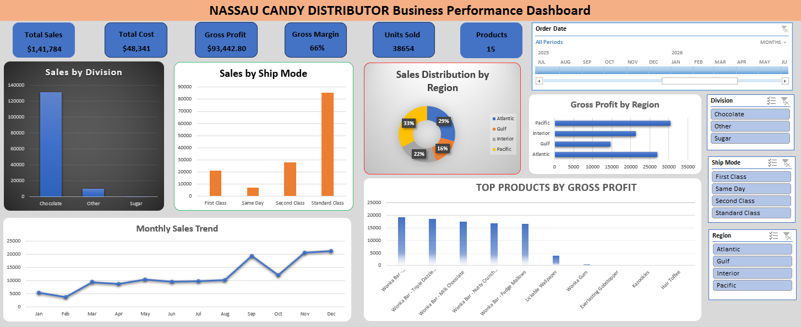

# 📊 Nassau Candy Distributor Business Performance Dashboard

## 📌 Project Overview

This project presents an interactive **Business Performance Dashboard** built in **Microsoft Excel** to analyze sales, profitability, product performance, regional performance, and shipping trends.

The dashboard enables business users to monitor key performance indicators (KPIs) and make data-driven decisions using Pivot Tables, Pivot Charts, KPI Cards, Slicers, and Timeline filters.

---

## 🎯 Business Objectives

- Analyze overall sales performance
- Monitor Gross Profit and Gross Margin
- Identify top-performing products
- Compare sales across business divisions
- Analyze regional profitability
- Track monthly sales trends
- Evaluate sales by shipping mode

---

## 🛠 Tools & Skills Used

- Microsoft Excel
- Pivot Tables
- Pivot Charts
- KPI Cards
- Slicers
- Timeline Filter
- Data Validation
- Data Cleaning
- Business Analysis
- Dashboard Design

---

## 📈 Key KPIs

- Total Sales
- Total Cost
- Gross Profit
- Gross Margin %
- Total Units Sold
- Total Products

---

## 📊 Dashboard Features

- Interactive KPI Cards
- Dynamic Pivot Charts
- Timeline Filter
- Region Slicer
- Division Slicer
- Ship Mode Slicer
- Monthly Sales Trend
- Product Profit Analysis
- Regional Profit Analysis

---

## 📷 Dashboard Preview

> Dashboard Screenshot
# 📊 Nassau Candy Distributor Business Performance Dashboard

## 📌 Project Overview

This project presents an interactive **Business Performance Dashboard** built in **Microsoft Excel** to analyze sales, profitability, product performance, regional performance, and shipping trends.

The dashboard enables business users to monitor key performance indicators (KPIs) and make data-driven decisions using Pivot Tables, Pivot Charts, KPI Cards, Slicers, and Timeline filters.

---

## 🎯 Business Objectives

- Analyze overall sales performance
- Monitor Gross Profit and Gross Margin
- Identify top-performing products
- Compare sales across business divisions
- Analyze regional profitability
- Track monthly sales trends
- Evaluate sales by shipping mode

---

## 🛠 Tools & Skills Used

- Microsoft Excel
- Pivot Tables
- Pivot Charts
- KPI Cards
- Slicers
- Timeline Filter
- Data Validation
- Data Cleaning
- Business Analysis
- Dashboard Design

---

## 📈 Key KPIs

- Total Sales
- Total Cost
- Gross Profit
- Gross Margin %
- Total Units Sold
- Total Products

---

## 📊 Dashboard Features

- Interactive KPI Cards
- Dynamic Pivot Charts
- Timeline Filter
- Region Slicer
- Division Slicer
- Ship Mode Slicer
- Monthly Sales Trend
- Product Profit Analysis
- Regional Profit Analysis

---

## 📷 Dashboard Preview

> Dashboard Screenshot



---

## 💡 Key Business Insights

- Chocolate division generated the highest sales.
- Standard Class contributed the highest sales among shipping modes.
- Pacific region generated the highest gross profit.
- Gross Margin remained above 66%, indicating strong profitability.
- Monthly sales increased significantly during the final quarter.

---

## 📂 Repository Structure

```
📁 nassau-candy-business-performance-dashboard
│
├── README.md
├── Nassau_Candy_Business_Performance_Dashboard.xlsx
├── dashboard.png
├── Nassau Candy Distributor.csv
└── LICENSE
```

---

## 🚀 How to Use

1. Download the Excel workbook.
2. Open it using Microsoft Excel.
3. Navigate to the Dashboard sheet.
4. Use the Timeline and Slicers to interact with the dashboard.

---

## 👨‍💻 Author

**Abinash Manna**

GitHub:
https://github.com/AbinashPortfolio

---

## ⭐ If you found this project useful, consider giving it a Star.


---

## 💡 Key Business Insights

- Chocolate division generated the highest sales.
- Standard Class contributed the highest sales among shipping modes.
- Pacific region generated the highest gross profit.
- Gross Margin remained above 66%, indicating strong profitability.
- Monthly sales increased significantly during the final quarter.

---

## 📂 Repository Structure

```
📁 nassau-candy-business-performance-dashboard
│
├── README.md
├── Nassau_Candy_Business_Performance_Dashboard.xlsx
├── dashboard.png
├── Nassau Candy Distributor.csv
└── LICENSE
```

---

## 🚀 How to Use

1. Download the Excel workbook.
2. Open it using Microsoft Excel.
3. Navigate to the Dashboard sheet.
4. Use the Timeline and Slicers to interact with the dashboard.

---

## 👨‍💻 Author

**Abinash Manna**

GitHub:
https://github.com/AbinashPortfolio

---

## ⭐ If you found this project useful, consider giving it a Star.
